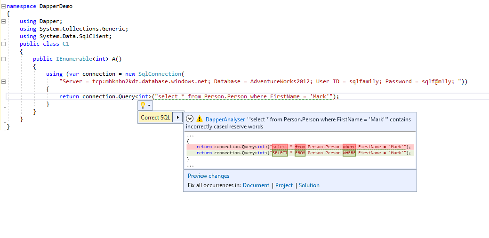

# Dapper Linter

This project is an analyser to ensure consistent formatting of SQL used in Dapper queries.

It ensures that all SQL reserve words are upper cased (and provides a fixer) to allow for easier reading.

